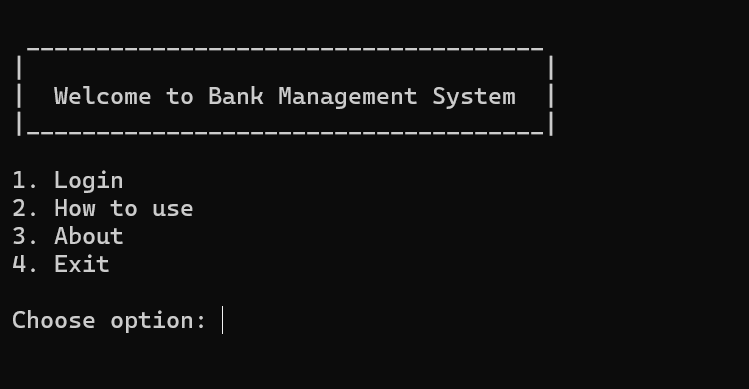
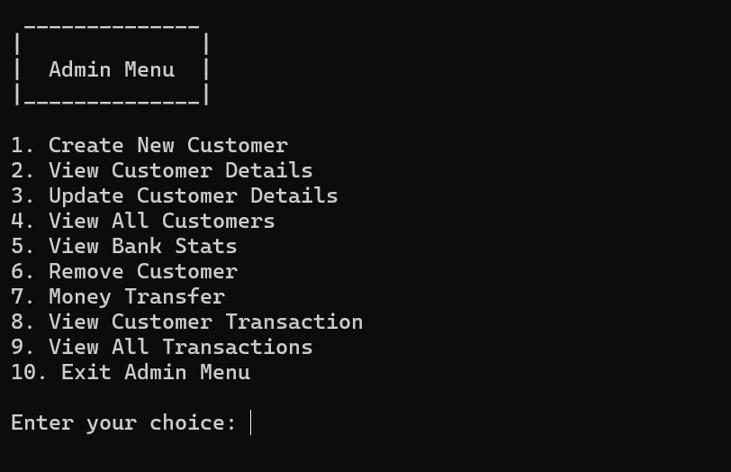
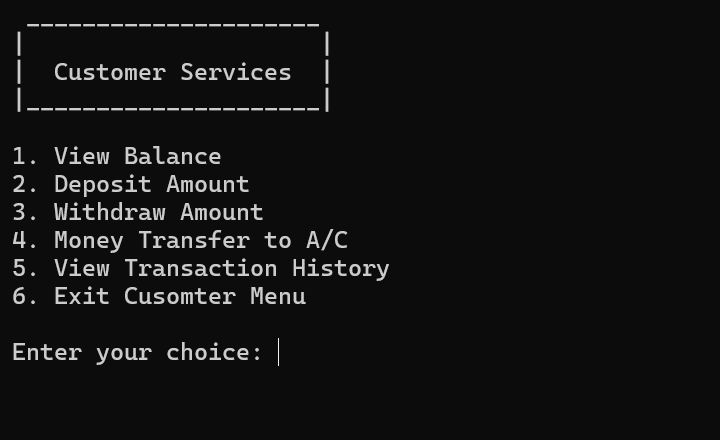

# Bank Management System in C

A **modular, file-based Bank Management System** implemented in pure C language.  
This project demonstrates structured programming, role-based access (Admin & Customer), transaction management, and file persistence using binary files.

---

## 📌 Author
**Akhilesh Tiwari**  
- 📧 Email: [akhileshtiwari8033@gmail.com](mailto:akhileshtiwari8033@gmail.com) 
- 🌐 GitHub: [github.com/asdtiwari](https://github.com/asdtiwari)
- 🤵 LinkedIn: [asdtiwari](https://linkedin.com/in/asdtiwari)
- 💬 Twitter: [asdtiwari](https://x.com/asdtiwari)
- 👤 Leetcode: [asdtiwari](https://leetcode.com/asdtiwari)
- 📷 Instagram: [asdtiwari](https://instagram.com/asdtiwari)

---

## 🚀 Features

### 👨‍💼 Admin
- Create a new customer account  
- Modify existing customer details  
- Delete a customer account  
- View all customers  
- Transfer money from one account to another  
- View entire bank transaction history  
- View overall bank statistics  

### 👤 Customer
- Deposit money  
- Withdraw money  
- Transfer money to another account  
- View personal transaction history  

### 🔧 Common Utilities
- Encrypted password storage (simple Caesar cipher)  
- Hidden password input (masked with `*`)  
- Timestamp logging for transactions  
- File-based data persistence  

---

## 🗂️ Project Structure

```
bank_management_system/
│
├── src/                            # Source code
|   ├── bank_management_system.c    # To open the program in full screen console
│   ├── main.c                      # Entry point
│   ├── admin.c                     # Admin functionalities
│   ├── customer.c                  # Customer functionalities
│   ├── transaction.c               # Transaction logging and history
│   ├── utils.c                     # Helper functions (mask, encrypt, timestamp, UI helpers)
│   ├── ui.c                        # Homepage, About, Manual, Menus
│   ├── auth.c                      # Authentication system
│   ├── file_handler.c              # File operations (CRUD for customers/transactions)
│   └── build.c                     # Automated compiler script
│
├── include/                        # Header files
│   ├── admin.h
│   ├── customer.h
│   ├── transaction.h
│   ├── utils.h
│   ├── ui.h
│   ├── auth.h
|   ├── role.h
│   └── file_handler.h
│
├── data/                           # Binary data files (auto-created at runtime)
│   ├── customers.dat
│   └── transactions.dat
│
├── bin/                            # Compiled executables
│   └── app.exe
│
├── build.c                         # On click compilation
└── docs
    └── README.md                   # Project documentation
```

---

## 📖 Program Flow

### Home Page


### Login
- Admin login with special account no & password
- For Demo purpose, Admin Credential
    - Username: `666666`
    - Password: `admin123`
- Customer login with registered account  

### Admin Menu


### Customer Menu


---

## 🎯 Objectives of the Project
- To provide a **role-based secure banking system** in C.  
- To practice **file handling techniques** (read, write, append, delete).  
- To demonstrate **transaction logging** with timestamps.  
- To show **modular programming** using multiple `.c` and `.h` files.  
- To implement a **console-based interactive UI** for learning purposes.  

---

## 🔍 C Language Concepts Used
- **Structures (`struct`)** → Customer, Transaction models  
- **File Handling (`fopen`, `fwrite`, `fread`, `fclose`)**  
- **Header files & modular design** → Code separation  
- **Pointers and dynamic memory** usage  
- **Custom string manipulation** (`strcpy`, `strcat`, etc.)  
- **Functions & recursion** (menus call themselves until exit)  
- **Control statements** (loops, switch-case, if-else)  
- **Compile-time macros** for constants and file paths  
- **Password masking & encryption** for basic security  

---

## 📊 Bank Statistics (Admin Only)
- Total customers in bank  
- Total bank balance  
- Highest & lowest balances  
- Average balance per customer  

---

## 🛠️ Build & Run Instructions

### Windows (MinGW)
1. Clone repository  
   ```
   git clone https://github.com/asdtiwari/bank_management_system.git
   cd bank_management_system
   ```
2. Build project
    ```
    gcc src/main.c src/admin.c src/customer.c src/transaction.c src/utils.c src/file_handler.c src/auth.c src/ui.c -Iinclude -o bin/app -Wall -g -mconsole 
    ```
    or simply run:
    ```
    gcc src/build.c -o build && build.exe
    ```
3. Run project
    ```
    ./bin/app.exe
    ```
    
    `Linux / Mac (minor changes)`
    Replace windows.h, conio.h, and system("cls") with cross-platform alternatives like stdlib.h and system("clear").
    
    `Then compile with gcc.`
    ```
    gcc src/main.c src/admin.c src/customer.c src/transaction.c src/utils.c src/file_handler.c src/auth.c src/ui.c -Iinclude -o app -Wall -g 
    ```
    `To run`
    ```
    ./app
    ```
---

## 🔮 Future Enhancements
This project is designed to be expandable. Some planned features:
- **Loan Management** – Apply for and manage loans
- **Fixed Deposit (FD) & Recurring Deposit (RD)** modules
- **ATM Simulation** – Card/PIN-based interface
- **Graphical User Interface (GUI)** – Using GTK or ncurses
- **Database Integration** – Replace flat files with MySQL/PostgreSQL

---

## 📖 Documentation & Notes
- All customer and transaction data is stored in the `data/` directory.  
- Files use **binary mode** for efficiency and security.  
- Each module is fully independent and communicates through clearly defined function declarations in header files.  
- Error handling ensures that corrupted or partial files don’t crash the system.  

---

## 📜 License
This project is released under the **MIT License**.  
You are free to use, modify, and distribute it with attribution.

---

## 👨‍🏫 Credits
- Developed by **Akhilesh Tiwari**  
- Guided by practical modular C project principles  
- Inspired by real-world banking workflows  

---

## ⭐ Contributing
Contributions are welcome!  
If you’d like to improve this project:
1. Fork the repository  
2. Create a new branch (`feature-new`)  
3. Commit your changes  
4. Submit a Pull Request  

---

## 🙌 Support
If you find this project helpful, don’t forget to ⭐ star the repository!  
For issues or feature requests, please open an **issue** in the repo.  

---
